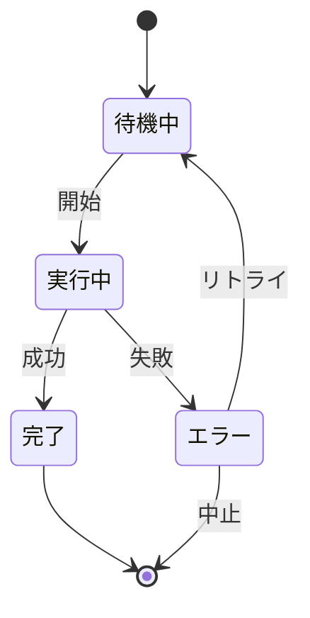

```mermaid
stateDiagram-v2
    [*] --> 待機中
    待機中 --> 実行中: 開始
    実行中 --> 完了: 成功
    実行中 --> エラー: 失敗
    完了 --> [*]
    エラー --> 待機中: リトライ
    エラー --> [*]: 中止
```

```mermaid
stateDiagram-v2
    [*] --> 待機中
    待機中 --> 実行中: 開始
    実行中 --> 完了: 成功
    実行中 --> エラー: 失敗
    完了 --> [*]
    エラー --> 待機中: リトライ
    エラー --> [*]: 中止
```