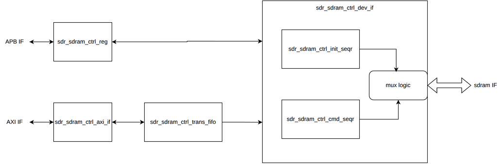
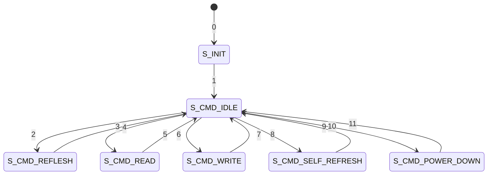

# sdr_sdram_ctrl 機能仕様書

## 概要
本モジュールはSDR SDRAMのコントローラモジュールです。
以下の要素を持ちます。

- 制御レジスタによる設定変更(APBバス)
- メモリマップへのマッピング(AXIバス)

SDRAMのClock Suspend,Active Popwer-Downモードには非対応です。
## 入出力ポート

## ブロック図
ブロック図を下記に締め示す。

##　サブモジュール

### sdr_sdram_ctrl_reg
本モジュールの設定、制御レジスタを持ちます。

### sdr_sdram_ctrl_axi_if
AXI IFを持ちます。このAXI IFからメモリマップにマッピングされたアドレスにアクセスできます。
アウトスタンディングに対応市、内部に AXI トランザクションのFIFO(trans fifo)を持ちます。

FIFOに溜まったAXI トランザクションをSDRAMデバイスの各アクセス命令にデコードします。

addr trans fifo　はAXI AR,AWトランザクションをfifoに格納します。fifoの深さは16です。

本モジュールにおけるarready,awreadyのdefault値はlowです。アドレスチャネルのvalid信号(axvalid)が
highになると、本モジュールはfifoがfull出ないことを確認し、fifoにデータを書き込むと同時に、
対応チャネルのready信号(axready)をhighにし、トランザクションを完了します。
AR,AWチャネルの書き込みは、先に来たトランザクションを優先してFIFOに格納します。
AR,AWチャネルのトランザクションが同時に来た場合、AWチャネルのトランザクションを優先して
FIFOに書き込みます。

wdata trans fifoはWトランザクションをfifoに格納します。fifoの深さは64です。
本モジュールにおけるwreadyのdefault値はlowです。wvalidがhighになると、
本モジュールはwdata trans fifoがfull出ないことを確認し、fifoにデータを書き込むと同時に、
wreadyをhighにし、トランザクションを完了します。

fifoにデータが溜まると、FIFOからトランザクションし、SDRAMの各アクセス命令にデコードし、
sdr_sdram_ctrl_dev_ifモジュールに命令を渡します。

dev_ifモジュールに渡す信号を以下に示します

|信号名|ビット幅|方向(axi_ifモジュールから見た方向)|概要|
|-|-|-|-|
|valid|1| output |valid信号|
|readh|1| input |ready信号|
|is_write|1|output|0の場合、read,1の場合、write|
|banck|2|output|バンクNo|
|row|13|output|行No|
|col|10|output|列No|
|wdata|32|output|write data
|rdata|32|input|read data|
|prechage_sel|2|output|0:信号アクセス後、prechage命令発行、1: auto_prechage,2prechageなし|

### sdr_sdram_ctrl_dev_if
sdramデバイスとのIFを持ちます。

FSMを下記に示します。

|遷移番号|fsm遷移条件|
|||

#### S_INIT
リセット時、S_INIT状態に遷移し、リセット解除後にSRAMデバイスのSRAMデバイスの
初期化シーケンスを実行します。S_INIT状態の際のSDRAMの制御はsdr_sdram_ctrl_init_seqrモジュールが行います。

リセットシーケンス後、S_CMD_IDLE状態に遷移し、sdr_sdram_ctrl_axi_ifモジュール
からのread,write命令を受け取り可能になります。

初期化シーケンスの流れを以下に示します。

#### S_CMD_READ,S_CMD_WRITE
axi_ifモジュールからトランザクションを受け取ると、
S_CMD_READ,S_CMD_WRITE状態に遷移します。
SCMD_READ,S_CMD_WRITE状態では、active, read or write, prechageを行います。
ただし、activeとprechageはトランザクションと直前の状態によって発行するか
どうかが変わります。
内部信号として、以下を情報を持ちます。

- is_active(現在、どこかの行がアクティブになっているか)
- active_col(アクティブになっている行)

命令の発行順の通りです。

##### is_active == 0 
prechage_sel == 0の場合
- active => read or write => prechage  is_active =　0

prechage_sel == 1の場合
- active => read or write(auto prechage en ==1)　is_active =　0

prechage_sel == 2の場合
- active => read or write -> is_active ==1 ,active_col = col

##### is_active == 1の場合
トランザクション.col == active_colの場合、active発行せずにread or writeを発行

トランザクション.col != active_colの場合、prechage -> active -> activeread or writeを発行

その後の動作はis_active == 0と同じ動作と成る

#### S_CMD_REFLESH
一定間隔でS_CMD_REFLESHに遷移し、reflesh命令を発行します。
リフレッシュ間隔はレジスタ(TBD)からサイクル単位で設定可能です。

#### S_CMD_SELF_REFLESH
レジスタ(TBD)がenableになると、この状態に遷移します。
この状態に遷移すると、
以下の状態を行ってSDRAMをself_reflesh状態に設定します。
- is_active ==1の場合、active_colをprechageする
- CKE信号をlowに市 、AUTO REFRESHコマンドを発行する

self reflesh　状態の際はclkをDRAMデバイスに供給しません。

レジスタ(TBD)がenableからdisableにすることで、以下の動作を行ってauto refresh状態を解除します。

- clkをDRAMデバイスに供給を再開し、5サイクル(TBD)待つ。
- CKE信号をHIGHに戻し、NOPコマンドを発行する
- NOPコマンドをレジスタ(TBD)サイクル間発行し続ける
- 通常状態に戻る

#### S_CMD_POWER_DOWN
レジスタ(TBD)がenableにしている状態でS_CMD_IDLE状態が50サイクル(TBD)続くと、
この状態に遷移します。
この状態に遷移すると、
以下の状態を行ってSDRAMをpower down状態に設定します。
- CKE信号をlowにし 、NOPコマンドを発行する

power down動作の際はclkをDRAMデバイスにclkに共有し続けます

レジスタ(TBD)がenableからdisableに設定される or 
refresh 周期に到達  or 
axi_ifからトランザクションが到達

することで以下の動作を行ってpower down状態を解除します。

- CKE信号をHIGHに戻す
- 通常状態に戻る

