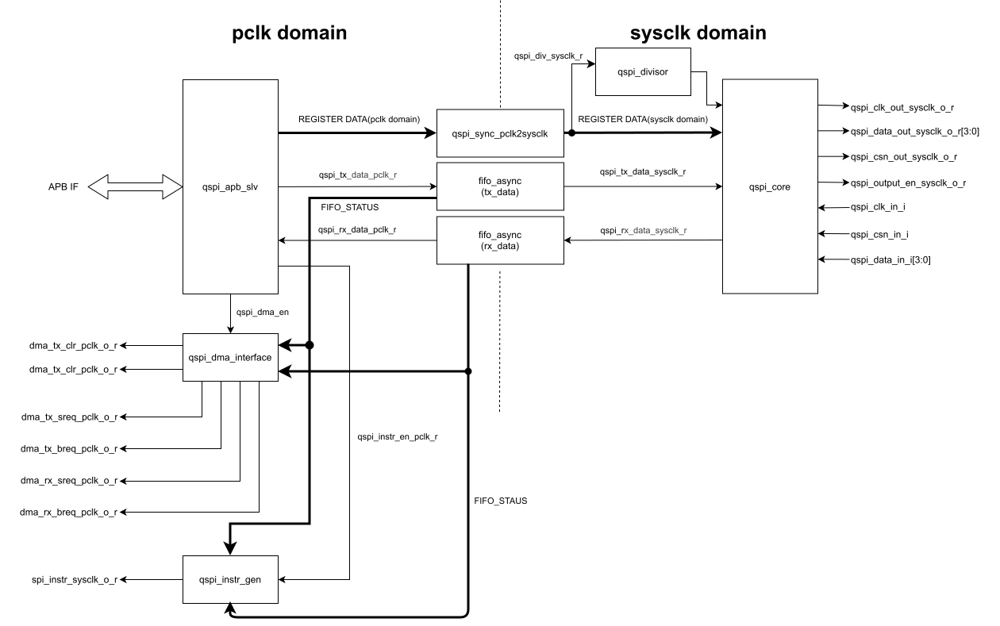
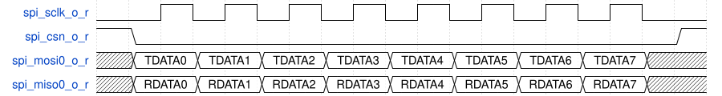
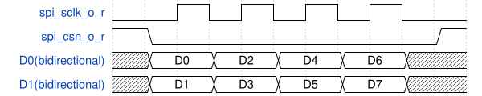
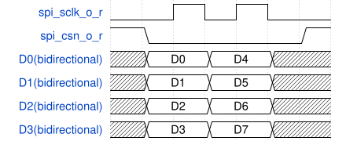
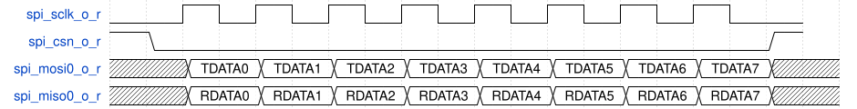
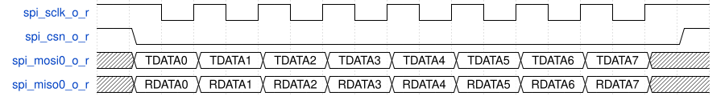
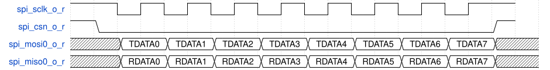
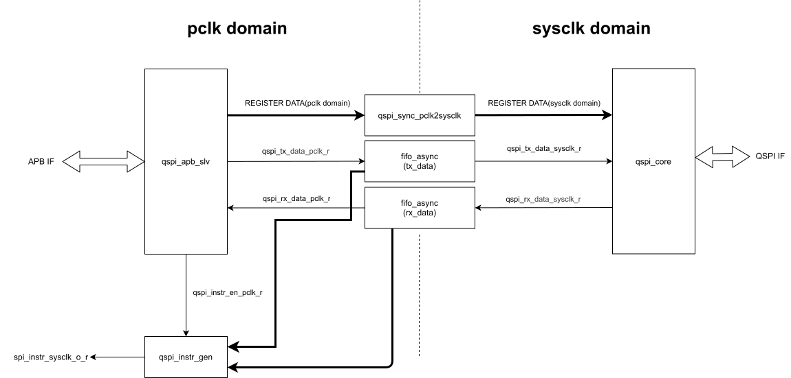
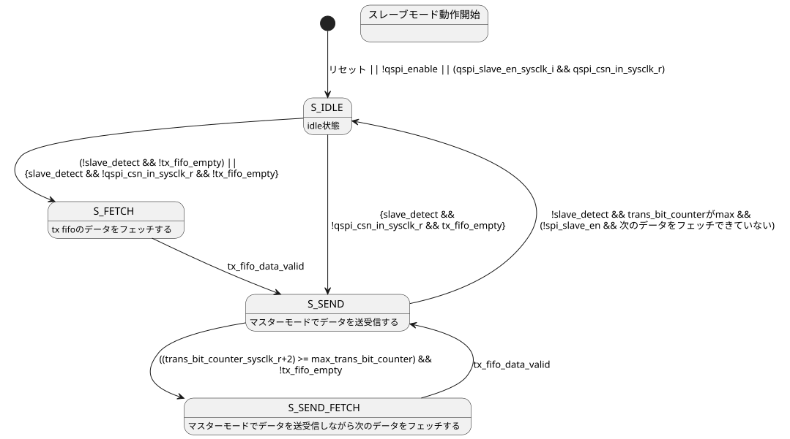

# 概要
本モジュールはQSPI通信のMaster動作モジュールです
本モジュールの機能概要を以下に示します。

- Master動作とSlave動作を選択可能
- 転送ビット幅(Single(全二重、半二重),Double,Quad)設定可能
- クロックの位相、極性を選択可能
- SPIの転送レート速度変更可能
- CSの自動/手動背制御対応
- 送信順序設定可能(LSBファースト、MSBファースト)
- 複数スレーブに対応可能(最大4)
- ワードビット幅変更可能(4,8,16 bit)
- 送受信FIFO搭載(16bit,32 Word)

# 入出力信号

## クロック信号

| 信号名 | I/O   | 同期クロック | 概要                 |
|--------|-------|--------------|----------------------|
| pclk   | Input | -            | APBクロック信号      |
| sysclk | Input | -            | システムクロック信号 |

## リセット信号

| 信号名         | I/O   | 同期クロック | 概要                 |
|----------------|-------|--------------|----------------------|
| presetn        | Input | pclk         | APBリセット信号      |
| srstn_sysclk | Input | sysclk       | システムリセット信号 |

## AXI4lite関連信号

| 信号名                    | I/O    | 同期クロック | 概要                          |
|---------------------------|--------|--------------|-------------------------------|
| awvalid                   | Input  | aclk         | AXI Writeアドレス Valid信号   |
| awready                   | Output | aclk         | AXI Writeアドレス Ready信号   |
| awid[ACTUAL_ID_WIDTH-1:0] | Input  | aclk         | AXI Writeアドレス ID信号      |
| awaddr[ADDRESS_WIDTH-1:0] | Input  | aclk         | AXI Writeアドレス信号         |
| awprot[2:0]               | Input  | aclk         | AXI Writeプロテクション信号   |
| wvalid                    | Input  | aclk         | AXI Writeデータ Valid信号     |
| wready                    | Output | aclk         | AXI Writeデータ Ready信号     |
| wdata[BUS_WIDTH-1:0]      | Input  | aclk         | AXI Writeデータ信号           |
| wstrb[BUS_WIDTH/8-1:0]    | Input  | aclk         | AXI Writeストローブ信号       |
| bvalid                    | Output | aclk         | AXI Writeレスポンス Valid信号 |
| bready                    | Input  | aclk         | AXI Writeレスポンス Ready信号 |
| bid[ACTUAL_ID_WIDTH-1:0]  | Output | aclk         | AXI Writeレスポンス ID信号    |
| bresp[1:0]                | Output | aclk         | AXI Writeレスポンス信号       |
| arvalid                   | Input  | aclk         | AXI Readアドレス Valid信号    |
| arready                   | Output | aclk         | AXI Readアドレス Ready信号    |
| araddr[ADDRESS_WIDTH-1:0] | Input  | aclk         | AXI Readアドレス信号          |
| arid[ACTUAL_ID_WIDTH-1:0] | Input  | aclk         | AXI Readアドレス ID信号       |
| arprot[2:0]               | Input  | aclk         | AXI Readプロテクション信号    |
| rvalid                    | Output | aclk         | AXI Readデータ Valid信号      |
| rready                    | Input  | aclk         | AXI Readデータ Ready信号      |
| rid[ACTUAL_ID_WIDTH-1:0]  | Output | aclk         | AXI Readデータ ID信号         |
| rresp[1:0]                | Output | aclk         | AXI Readレスポンス信号        |
| rdata[BUS_WIDTH-1:0]      | Output | aclk         | AXI Readデータ信号            |

## QSPI関連信号

| 信号名                           | I/O    | 同期クロック | 概要                             |
|----------------------------------|--------|--------------|----------------------------------|
| qspi_sclk_out_sysclk_o_r         | Output | sysclk       | QSPI 出力クロック                 |
| qspi_sclk_out_en_sysclk_o_r      | Output | sysclk       | QSPI 出力クロックイネーブル       |
| qspi_csn_out_sysclk_o_r[3:0]     | Output | sysclk       | QSPI 出力チップセレクト           |
| qspi_csn_out_en_sysclk_o_r[3:0]  | Output | sysclk       | QSPI 出力チップセレクトイネーブル |
| qspi_data_out_sysclk_o_r[3:0]    | Output | sysclk       | QSPI 出力データ0                  |
| qspi_data_out_en_sysclk_o_r[3:0] | Output | sysclk       | QSPI 出力ネーブル信号             |

| 信号名              | I/O   | 同期クロック | 概要                   |
|---------------------|-------|--------------|------------------------|
| qspi_sclk_in_i       | Input | sysclk       | QSPI 入力クロック       |
| qspi_csn_in_i[3:0]  | Input | sysclk       | QSPI 入力チップセレクト |
| qspi_data_in_i[3:0] | Input | sysclk       | QSPI 入力データ0        |

## 割り込み関連信号

| 信号名              | I/O    | 同期クロック | 概要             |
|---------------------|--------|--------------|------------------|
| qspi_instr_aclk_o_r | Output | sysclk       | 割り込み出力信号 |

# ブロック
本モジュールのブロック図を以下に示します

クロック信号とリセット信号は省略し、各モジュールのクロックドメインのみ記載します
また、各モジュールの接続信号は主要のデータ線のみしるします。

# レジスタ

| Offset | レジスタ名      | 初期値 | 概要                                  |   |
|--------|-----------------|--------|---------------------------------------|---|
|        |                 |        |                                       |   |
| 0x00   | QSPI_CTRL       | 0x00   | QSPIコントロールレジスタ              |   |
| 0x04   | QSPI_SW_RESET   | 0x00   | QSPIソフトウェアリセットレジスタ      |   |
| 0x08   | QSPI_CS_CTRL    | 0x0F   | QSPIチップセレクトレジスタ            |   |
| 0x0C   | QSPI_MASTER_CLK | 0x00   | QSPIクロックレジスタ                  |   |
| 0x10   | QSPI_DATA       | 0x00   | QSPIデータレジスタ                    |   |
| 0x14   | QSPI_INT        | 0x00   | QSPI割り込みコントロールレジスタ      |   |
| 0x18   | QSPI_STATUS     | 0x00   | QSPI FIFOステータスレジスタ           |   |
| 0x1C   | QSPI_INTR_RS    | 0x00   | QSPI 割り込み生ステータスレジスタ     |   |
| 0x20   | QSPI_INTR_MS    | 0x00   | QSPI 割り込みマスクステータスレジスタ |   |
    

## QSPI_CTRL

| Bit     | Field名        | Read/Write | 初期値 | 概要                                                                                                                             |
|---------|----------------|------------|--------|----------------------------------------------------------------------------------------------------------------------------------|
| [31:28] | rx_latch_delay | R/W        | 4'b0   | Master時、受信データをラッチするタイミングを遅らせる値を書いてください                                                           |
| [27:25] | Reserved       | -          | -      | 書き込みは無視されます。読み込みは0が読み出されます                                                                              |
| [24]    | order          | R/W        | 1'b0   | 送信順序選択 0:MSBファースト 1:LSBファースト                                                                               |
| [23:22] | Reserved       | -          | -      | 書き込みは無視されます。読み込みは0が読み出されます                                                                              |
| [21]    | cpha           | R/W        | 1'b0   | クロック位相選択 0 : 立ち上がりエッジ 1 :立ち下がりエッジ                                                                  |
| [20]    | cpol           | R/W        | 1'b0   | クロック極性選択 0 : アクティブハイ 1 : アクティブロー                                                                     |
| [19:17] | Reserved       | -          | -      | 書き込みは無視されます。読み込みは0が読み出されます                                                                              |
| [16]    | spi_slave_en   | R/W        | 1'b0   | SPI Master/Slave選択. Dual,Quad SPIの場合、この値は無視されます  1'b0:Master 1'b1:Slave                                                                                |
=| [15:12] | word_width     | R/W        | 4'b1   | 転送ワード幅設定.0は設定禁止。 Double転送、Quad転送の場合は無効です                                                                         |
| [11:10] | Reserved       | -          | -      | 書き込みは無視されます。読み込みは0が読み出されます                                                                              |
| [9:8]   | protocol_sel   | R/W        | 2'b0   | プロトコル選択 2'b00:Single SPI(全二重転送) 2'b10:Double SPI 2'b11:Quad SPI                                             |
| [7:6]   | Reserved       | -          | -      | 書き込みは無視されます。読み込みは0が読み出されます                                                                              |
| [5:4]   | trans_dir      | R/W        | 1'b0   | Dual,Quad SPIの場合、送受信方向を選択 *Single SPIの場合、この値は無視されます 0:受信設定 1:送信設定<bd>2:ダミーサイクル |
| [3:1]   | Reserved       | -          | -      | 書き込みは無視されます。読み込みは0が読み出されます                                                                              |
| [0]     | qspi_enable    | R/W        | 1'b0   |  0:spi動作無効 1:spi動作有効                                                                                               |

## QSPI_SW_RESET
| Bit    | Field名    | Read/Write | 初期値 | 概要                                                                              |
|--------|------------|------------|--------|-----------------------------------------------------------------------------------|
| [31:1] | Reserved   | -          | -      | 書き込みは無視されます。読み込みは0が読み出されます                               |
| [0]    | sw_rst_n | R/W        | 1'b1   | ソフトウェアリセット 1'b0:ソフトウェアリセット有効 ソフトウェアリセット無効 |

## QSPI_CS_CTRL
| Bit     | Field名      | Read/Write | 初期値 | 概要                                                |
|---------|--------------|------------|--------|-----------------------------------------------------|
| [31:11] | Reserved     | -          | -      | 書き込みは無視されます。読み込みは0が読み出されます |
| [8]     | cs_manual    | R/W        | 1'b1   | CS自動制御時の信号値を設定します                    |
| [7:5]   | Reserved     | -          | -      | 書き込みは無視されます。読み込みは0が読み出されます |
| [4]     | cs_manual_en | R/W        | 1'b0   | 0:CSを自動で制御します,1:CSを手動で制御します       |
| [3:2]   | Reserved     | -          | -      | 書き込みは無視されます。読み込みは0が読み出されます |
| [1:0]   | cs_sel       | R/W        | 2'b00  | 出力する制御信号を選択します                        |

## QSPI_MASTER_CLK

| Bit     | Field名     | Read/Write | 初期値 | 概要                                                            |
|---------|-------------|------------|--------|-----------------------------------------------------------------|
| [32:16] | Researved   | -          | -      | 書き込みは無視されます。読み出しは0が読み出されます。           |
| [15:0]  | clk_divisor | R/W        | 16'd0  | SPI転送レート設定 $$\frac{F_{sysclk}}{2(clk\_divisor + 1)}$$ |

## QSPI_DATA

書き込みデータは右詰めしてください。(無効ビットに書き込まれた値は無視されます。)

読み出しデータは右詰めされて出力されます。
| Bit     | Field名     | Read/Write | 初期値 | 概要                                                                                       |
|---------|-------------|------------|--------|--------------------------------------------------------------------------------------------|
| [32:16] | Researved   | -          |        | 書き込みは無視されます。読み出しは0が読み出されます。                                      |
| [17]    | rx_fifo_clr | W          |        | rx_fifoのデータをクリアします                                                              |
| [16]    | tx_fifo_clr | W          |        | tx_fifoのデータをクリアします                                                              |
| [15:0]  | data        | R/W        |        | ・書き込み時、TX_FIFOにデータを書き込みます ・読み込み時、RX_FIFOにデータを読み込みます |
|         |             |            |        |                                                                                            |

## QSPI_INT

各割り込みの有効無効を設定します
    
| Bit     | Field名           | Read/Write | 初期値 | 概要                                                                                                                                                        |
|---------|-------------------|------------|--------|-------------------------------------------------------------------------------------------------------------------------------------------------------------|
| [31:21] | Researved         | -          |        | 書き込みは無視されます。読み出しは0が読み出されます。                                                                                                       |
| [20]    | rx_fifo_overflow  | R/W        | 1'b0   | RX_FIFOがオーバーフローした時、割り込みが発生します。 1'b0:割り込み無効 1'b1割り込み有効                                                              |
| [19:17] | Researved         | -          |        | 書き込みは無視されます。読み出しは0が読み出されます。                                                                                                       |
| [16]    | tx_fifo_overflow  | R/W        | 1'b0   | TX_FIFOがオーバーフローしたとき、割り込みが発生します。 1'b0:割り込み無効 1'b1割り込み有効                                                            |
| [15:13] | Researved         | -          |        | 書き込みは無視されます。読み出しは0が読み出されます。                                                                                                       |
| [12]    | rx_fifo_threshold | R/W        | 1'b0   | RX_FIFOに一定数データが溜まったとき、割り込みが発生します。トリガーレベルはQSPI_THESHOLD_LEVELレジスタで設定します 1'b0:割り込み無効 1'b1割り込み有効 |
| [11:9]  | Researved         | -          |        | 書き込みは無視されます。読み出しは0が読み出されます。                                                                                                       |
| [8]     | tx_fifo_threshold | R/W        | 1'b0   | TX_FIFOに一定数データがなくなったとき、割り込みが発生します。トリガーレベルはQSPI_THESHOLD_LEVELレジスタで設定します 1'b0:割り込み無効 1'b1割り込み有効 |
| [7:5]   | Researved         | -          |        | 書き込みは無視されます。読み出しは0が読み出されます。                                                                                                      |
| [4]     | rx_fifo_not_empty | R/W        | 1'b0   | RX_FIFOにデータがある時、割り込みが発生します。 1'b0:割り込み無効 1'b1割り込み有効                                                                    |
| [3:1]   | Researved         | -          |        | 書き込みは無視されます。読み出しは0が読み出されます。                                                                                                       |
| [0]     | tx_fifo_empty     | R/W        | 1'b0   | TX_FIFOがemptyになった時、割り込みを発生させます 1'b0:割り込み無効 1'b1割り込み有効                                                                   |

## QSPI_THESHOLD_LEVEL

| Bit     | Field名           | Read/Write | 初期値 | 概要                                                  |
|---------|-------------------|------------|--------|-------------------------------------------------------|
| [32:13] | Researved         | -          |        | 書き込みは無視されます。読み出しは0が読み出されます。 |
| [12:8]  | rx_theshold_level | R/W        |        | rx_fifo_threshold割り込みのトリガーレベルを設定します |
| [7:5]   | Researved         | -          |        | 書き込みは無視されます。読み出しは0が読み出されます。 |
| [4:0]   | tx_theshold_level | R/W        |        | tx_fifo_threshold割り込みのトリガーレベルを設定します |

## QSPI_STATUS

| Bit     | Field名           | Read/Write | 初期値 | 概要                                                                  |
|---------|-------------------|------------|--------|-----------------------------------------------------------------------|
| [31:15] | Researved         | -          |        | 書き込みは無視されます。読み出しは0が読み出されます。                 |
| [24]    | spi_busy          | R          | 1'b0   | 1'b0:SPIはidle状態です 1'b1:SPI動作中です                          |
| [23:21] | Researved         | -          |        | 書き込みは無視されます。読み出しは0が読み出されます。                 |
| [20:16] | rx_fifo_num       | R          | 5'b0   | RX_FIFOのデータ個数を示します                                         |
| [15:14] | Researved         | -          |        | 書き込みは無視されます。読み出しは0が読み出されます。                 |
| [13]    | rx_fifo_full      | R          | 1'b0   | RX_FIFOがFULLののとき、HIGHになります。 その時以外はLOWになります  |
| [12]    | rx_fifo_empty     | R          | 1'b0   | RX_FIFOがEMPTYののとき、HIGHになります。 その時以外はLOWになります |
| [11:9]  | Researved         | -          |        | 書き込みは無視されます。読み出しは0が読み出されます。                 |
| [8:4]   | tx_fifo_available | R          | 5'b0   | TX_FIFOの空き数を示します                                             |
| [3:2]   | Researved         | -          |        | 書き込みは無視されます。読み出しは0が読み出されます。                 |
| [1]     | tx_fifo_full      | R          | 1'b0   | TX_FIFOがFULLののとき、HIGHになります。 その時以外はLOWになります  |
| [0]     | tx_fifo_empty     | R          | 1'b0   | TX_FIFOがEMPTYののとき、HIGHになります。 その時以外はLOWになります |

## QSPI_INT_RS
マスクされる前の各割り込みの状態を示します

| Bit     | Field名           | Read/Write | 初期値 | 概要                                                        |
|---------|-------------------|------------|--------|-------------------------------------------------------------|
| [31:21] | Researved         | -          |        | 書き込みは無視されます。読み出しは0が読み出されます。       |
| [20]    | rx_fifo_overflow  | R/W        | 1'b0   | RX_FIFOがオーバーフローした時、割り込みが発生します。       |
| [19:17] | Researved         | -          |        | 書き込みは無視されます。読み出しは0が読み出されます。       |
| [16]    | tx_fifo_overflow  | R/W        | 1'b0   | TX_FIFOがオーバーフローしたとき、割り込みが発生します。     |
| [15:13] | Researved         | -          |        | 書き込みは無視されます。読み出しは0が読み出されます。       |
| [12]    | rx_fifo_threshold | R/W        | 1'b0   | RX_FIFOに一定数データが溜まったとき、割り込みが発生します。 |
| [11:9]  | Researved         | -          |        | 書き込みは無視されます。読み出しは0が読み出されます。       |
| [8]     | tx_fifo_threshold | R/W        | 1'b0   | TX_FIFOに一定数データがなくなったとき、割り込みが発生します。 |
| [7:5]   | Researved         | -          |        | 書き込みは無視されます。読み出しは0が読み出されます。       |
| [4]     | rx_fifo_not_empty | R/W        | 1'b0   | RX_FIFOにデータがある時、割り込みが発生します。             |
| [3:1]   | Researved         | -          |        | 書き込みは無視されます。読み出しは0が読み出されます。       |
| [0]     | tx_fifo_empty     | R/W        | 1'b0   | TX_FIFOがemptyになった時、割り込みを発生させます            |
|         |                   |            |        |                                           |

   

## QSPI_INT_MS
マスクされた後の各割り込みの状態を示します
各フィールドに１を書き込むと、対応する割り込み信号がクリアされます

| Bit     | Field名           | Read/Write | 初期値 | 概要                                                        |
|---------|-------------------|------------|--------|-------------------------------------------------------------|
| [31:21] | Researved         | -          |        | 書き込みは無視されます。読み出しは0が読み出されます。       |
| [20]    | rx_fifo_overflow  | R/W        | 1'b0   | RX_FIFOがオーバーフローした時、割り込みが発生します。       |
| [19:17] | Researved         | -          |        | 書き込みは無視されます。読み出しは0が読み出されます。       |
| [16]    | tx_fifo_overflow  | R/W        | 1'b0   | TX_FIFOがオーバーフローしたとき、割り込みが発生します。     |
| [15:13] | Researved         | -          |        | 書き込みは無視されます。読み出しは0が読み出されます。       |
| [12]    | rx_fifo_threshold | R/W        | 1'b0   | RX_FIFOに一定数データが溜まったとき、割り込みが発生します。 |
| [11:9]  | Researved         | -          |        | 書き込みは無視されます。読み出しは0が読み出されます。       |
| [8]     | tx_fifo_threshold | R/W        | 1'b0   | TX_FIFOに一定数データがなくなったとき、割り込みが発生します。 |
| [7:5]   | Researved         | -          |        | 書き込みは無視されます。読み出しは0が読み出されます。       |
| [4]     | rx_fifo_not_empty | R/W        | 1'b0   | RX_FIFOにデータがある時、割り込みが発生します。             |
| [3:1]   | Researved         | -          |        | 書き込みは無視されます。読み出しは0が読み出されます。       |
| [0]     | tx_fifo_empty     | R/W        | 1'b0   | TX_FIFOがemptyになった時、割り込みを発生させます            |

# 機能詳細
本モジュールの機能詳細について示します

## Master,Slave選択
本モジュールはSPI Master動作、Salve動作を選択可能です。
    ただし、Dual ,Quad SPIモードは、Masterのみしか対応しません。
Slave動作はSingle SPIモード時のみ有効です。

Masterモードの場合、spi_sclk_out_sysclk_o_r、spi_csn_out_sysclk_o_r信号をSPI通信のクロック、チップセレクトとして用います。
spi_sclk_out_sysclk_o_r、spi_csn_out_sysclk_o_rはHighになります

Slaveの場合、spi_clk_in_i spi_csn_in_i、信号をSPI通信のクロック、チップセレクトとして用います。
spi_sclk_out_sysclk_o_r、spi_csn_out_sysclk_o_rはLowになります

## 転送レート設定(Master動作)
Master動作の際、SPI通信の転送レートを設定できます。
SPI_MASTER_CLK.clk_divisorで転送レートを設定します。

転送レートは以下の式で導出します。
$$\frac{F_{sysclk}}{clk\_divisor + 1}$$

## 転送プロトコル選択
本モジュールは、SPIの入出力データ線を4本持ちます。
SPIのバス幅を設定することができます。
### Single
Single転送は、バス幅が１ビットの転送モードです。
２つのデータ線を使い、送信と受信を行います。
下記に示します。

転送ワード幅はレジスタ設定から変更可能です。

### Double
Double転送は、バス幅が2ビットの転送モードです。
Double転送は半二重転送です。

### Quad
Quad転送は、バス幅が4ビットの転送モードです。
Quad転送は半二重転送です。

Double,Quad転送の場合、
転送ワード幅は8ビットに固定です
spi_output_en_sysclk_o_r[3:0]はtrans_dirに応じて適切に自動で変更されます。
ダミーサイクルの場合、spi_output_en_sysclk_o_r[3:0]はlowになります

## クロック位相、極性設定
SPIのクロック位相(CPHA)、極性(CPOL)を設定可能です。
次節から、クロック位相、極性の各設定パターンの波形図を示します。
### CPOL=0,CPHA=0(mode 0)

複数ワードを連続して転送する場合は、ワード転送ごとに必ずチップセレクト信号をHIGHにし、
LOWにする動作が必要になります。
### CPOL=0,CPHA=1(mode 1)

### CPOL=1,CPHA=0(mode 2)

複数ワードを連続して転送する場合は、ワード転送ごとに必ずチップセレクト信号をHIGHにし、
LOWにする動作が必要になります。
### CPOL=1,CPHA=1(mode 3)

## 転送開始とりが
転送開始はTX FIFOにデータを書き込むことで開始します
Dual,Quad SPIモードで受信する際も、受信するバイト分ダミーデータを書き込んでください
ダミーサイクルの同様です

## CSの自動/手動背制御対応
CSを自動で制御する場合、転送開始する

## 送信順序選択
SPI通信の送信順序を設定できます。
SPI_CTRL.spi_orderで設定してください。

## 複数スレーブに対応(Master動作)
本モジュールがmaster動作を行う場合、
Slaveを最大4つまでもつことができます。

転送する際は、QSPI_CS_CTRL.cs_ctrlから、
各Slaveに対応するspi_csn_out_sysclk_o_rをLOWにし、転送開始してください

## ワードビット幅変更
本モジュールはSingle転送の場合、ワードのビット幅を4~16 bitまで選択可能です
Double転送、Quad転送の場合は8 bit固定です。
Sigle転送のワードビット幅はSPI_CTRL.word_widthで設定できます。

## 送受信FIFO
本モジュールは送信データFIFO、受信データFIFOを持ちます。
それぞれのFIFOのサイズは16 bit * 32 wordです。
送信データは右詰めして送信データFIFOに入力する必要があります。
受信データは右詰めして受信データFIFOに格納されます。

・書き込み時、TX_FIFOがFULLの場合、書き込みは無視されます)<読み込み時、RX_FIFOがEMPTYの場合、読み込みデータは0が読み出されます 

ダミーサイクルの場合、受信も送信もされず、クロック信号だけが動きます

## モジュール詳細

各モジュールの詳細について示します。

### 階層表

モジュールの階層表を以下に示します。
syncronizer,sync_handshakeモジュールは必要に応じて複数インスタンス化します

| 第１階層 | 第２階層              | 第３階層          |
| qspi_top |                       |                   |
|          | qspi_apb_slv          |                   |
|          | qspi_instr_gen        |                   |
|          | qspi_sync_pclk2sysclk | syncronizer       |
|          |                       | sync_handshake    |
|          | fifo_async(tx_data)   |                   |
|          | fifo_async(rx_data)   |                   |
|          | qspi_core             | qspi_core_divisor |
|          |                       | syncronizer       |

### qspi_apb_slv

qspi_apb_apb_slvモジュールはAPBバスと接続され、APB Masterからデータを受け渡しを行います。

### qspi_sync_pclk2sysclk
qspi_sync_pclk2sysclkモジュールはpclkドメインの各レジスタ信号をsysclkドメインに載せ替えます。

### fifo_async
fifo_asyncモジュールは送信データと受信データのクロックドメインの乗せ換えを行います。

### qspi_divisor
qspi_divisorは設定されたdivisorからMaster動作時のspi通信の転送タイミング信号を生成します
flactional divisorです

### qspi_int_generator
qspi_int_generatorモジュールは各FIFOのステータスを監視し、割り込み信号を生成します。

### qspi_core
qspi_coreモジュールはqspi信号を生成します

qspi_sw_rst_n_sysclk_i
qspi_cpol_sysclk_i
qspi_cpha_sysclk_i
qspi_order_sysclk_i
qspi_txdata_sysclk_i
qspi_slave_en_sysclk_i
qspi_protocol_sysclk_i
qspi_trans_dir_sysclk_i
qspi_word_width_sysclk_i
qspi_ct_mode_en_sysclk_i
qspi_ct_mode_protocol_sysclk_i
qspi_ct_mode_trans_dir_sysclk_i
qspi_ct_mode_word_width_sysclk_i
qspi_cs_ctrl_sysclk_i

qspi_coreモジュールのブロック図を以下に示します。

ステートマシンを以下に示します

