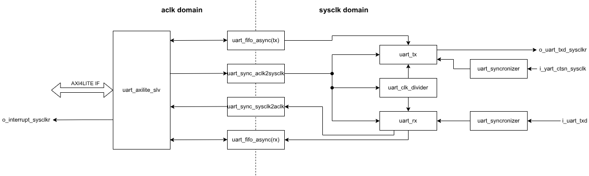
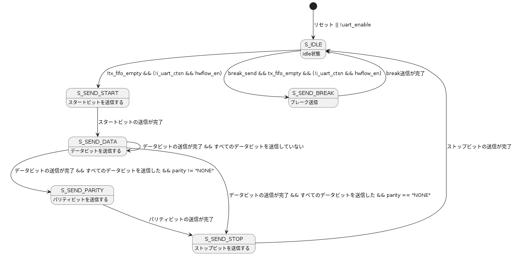
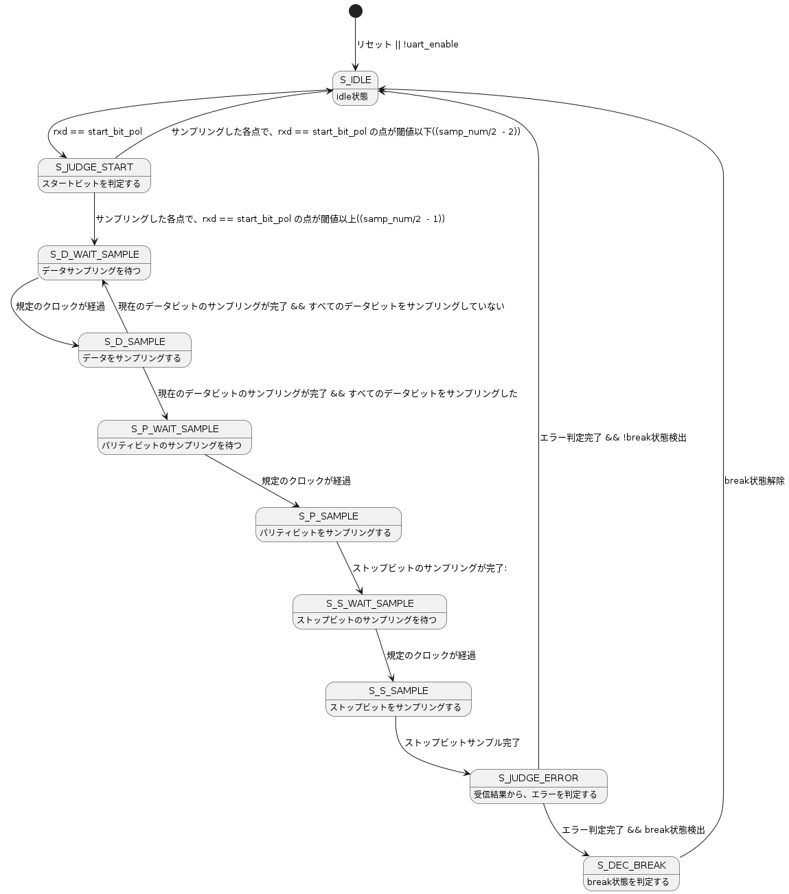

# UART設計仕様書

## 機能概要

本モジュールは以下の機能を持つ
* パリティビット選択(なし、偶数、奇数)
* スタートビット、ストップビットの極性選択
* HWフロー制御
* アイドル、ブレーク送受信対応
* データビット幅選択(5~9 bit)
* ボーレート選択(クロックの分周比を設定)
* ストップビットビット幅選択(0.5,1,1.5,2)
* オーバーサンプリング比選択(8,16,32)
* サンプリング点数選択(1,3)
* 割り込み機能(fifo系、通信エラー系)

## レジスタ一覧
| レジスタ名       | アドレス | 詳細                            |
|------------------|----------|---------------------------------|
| UART_CTRL        | 0x00     | UART Control                    |
| UART_CONF_FRAME  | 0x04     | UART Config Frame               |
| UART_CONF_MODE    | 0x08     | UART Mode Config                |
| UART_CONF_SAMP   | 0x0C     | UART Sampling Config            |
| UART_DATA        | 0x10     | UART Data                       |
| UART_STATUS | 0x14     | UART FIFO Status                |
| UART_INT_CTRL    | 0x18     | UART Interrupt Control Status   |
| UART_INT_CONF_TH | 0x20     | UART Interrupt Threshold config |
| UART_INT_RS      | 0x24     | UART Error Status               |
| UART_INT_MS      | 0x28     | UART Interrupt Masked Status    |

## レジスタ詳細

### UART_CTRL(0x00)

| ビット | フィールド名 | アクセス | 詳細                          |
|--------|--------------|----------|-------------------------------|
| [31:1] | reserved     | -        |                               |
| [0]    | uart_enable  | R/W      | 0:uart動作停止,1:uart動作開始 |

### UART_CONF_FRAME(0x04)
フレームの設定を行います。
| ビット  | フィールド名            | RW  | init | 詳細                                     |
|---------|-------------------------|-----|------|------------------------------------------|
| [31:12] | reserved                | -   | -    |                                          |
| [11:8]  | conf_data_bit_width     | R/W | 8    | データビット幅(5~9)*0~4はreseaved        |
| [7:6]   | reserved                | -   | -    |                                          |
| [5:4]   | conf_stop_bit_width_sel | R/W | 1    | 0: 0.5bit, 1: 1bit, 0x2:1.5bit, 0x3:2bit |
| [3:2]   | reserved                | -   | -    |                                          |
| [1:0]   | conf_parity_bit         | R/W | 0    | 0x0: 無効、 0x1:奇数、 0x2:偶数          |

### UART_CONF_MODE(0x08)
モードの設定を行います。

| ビット | フィールド名    | RW  | init | 詳細                              |
|--------|-----------------|-----|------|-----------------------------------|
| [31:6] | reserved        | -   | -    |                                   |
| [5]    | conf_tx_env     | R/W | 0    | tx送信極性変更 0x0:無効、0x1:有効 |
| [4]    | conf_rx_env     | R/W | 0    | rx送信極性変更 0x0:無効、0x1:有効 |
| [3:1]  | reserved        | -   | -    |                                   |
| [0]    | conf_hw_flow_en | R/W | 0    | HWフロー制御 0x0:無効、0x1:有効   |

### UART_CONF_SAMP(0x0C)
サンプリングの設定を行います。

| ビット  | フィールド名       | RW  | init | 詳細                          |
|---------|--------------------|-----|------|-------------------------------|
| [31:21] | reserved           | -   | -    |                               |
| [20]    | conf__samp_num_sel | R/W | 0    | 0x0: 1点、0x1:3点             |
| [19:18] | reserved           | -   | -    |                               |
| [17:16] | conf_over_samp_sel | R/W | 1    | 0x0: 8倍, 0x1: 16倍, 0x2:32倍 |
| [15:0]  | conf_clk_div       | R/W | 0    | サンプリング分周比設定        |

### UART_DATA(0x10)

| ビット | フィールド名 | RW  | init | 詳細                                 |
|--------|--------------|-----|------|--------------------------------------|
| [31:5] | reserved     | -   | -    |                                      |
| [4]    | break_send   | R/W | 0    | 1にしている間、break状態を送信します |
| [3:0]  | data         | R/W | 0    | W:txデータセット、R:受信データ取得   |

 
### UART_STATUS(0x14)
fifoのステータスを示します。

| ビット  | フィールド名  | RW | init | 詳細          |
|---------|---------------|----|------|---------------|
| [31:13] | reserved      | -  | -    |               |
| [12]    | rx_busy       | R  | 0    | rx busy       |
| [11:9]  | reserved      | -  | -    |               |
| [8]     | tx_busy       | R  | 0    | tx busy       |
| [7:6]   | reserved      | -  | -    |               |
| [5]     | rx_fifo_full  | R  | 0    | rx fifo full  |
| [4]     | rx_fifo_empty | R  | 0    | rx fifo empty |
| [3:2]   | reserved      | -  | -    |               |
| [1]     | tx_fifo_full  | R  | 0    | tx fifo full  |
| [0]     | tx_fifo_empty | R  | 0    | tx fifo empty |

### UART_INT_CTRL(0x18)
割り込みを設定します。
割り込みを有効にしたい要因のフィールドに１を書き込むことで、有効になります。

| ビット  | フィールド名       | RW  | init | 詳細                                                           |
|---------|--------------------|-----|------|----------------------------------------------------------------|
| [31:25] | reserved           | -   | -    |                                                                |
| [24]    | int_break_det_en   | R/W | 0    | ブレーク(一定期間Low)検出割り込み                              |
| [23:21] | reserved           | -   | -    |                                                                |
| [20]    | int_parity_err_en  | R/W | 0    | パリティエラー割り込み                                         |
| [19:17] | reserved           | -   | -    |                                                                |
| [16]    | int_framing_err_en | R/W | 0    | フレーミングエラー割り込み                                     |
| [15:13] | reserved           | -   | -    |                                                                |
| [12]    | int_rx_timeout_en  | R/W | 0    | rx_fifoにデータがある && 一定時間(4データ受信分)受信しなかった |
| [11:9]  | reserved           | -   | -    |                                                                |
| [8]     | int_overrun_err_en | R/W | 0    | オーバーランエラー(RX FIFO溢れ)割り込み                        |
| [7:5]   | reserved           | -   | -    |                                                                |
| [4]     | int_tx_fifo_th_en  | R/W | 0    | TX FIFO閾値(送信データ要求)割り込み                            |
| [3:1]   | reserved           | -   | -    |                                                                |
| [0]     | int_rx_fifo_th_en  | R/W | 0    | RX FIFO閾値(受信データあり)割り込み                            |

### UART_INT_CONF_TH(0x20)
int_rx_fifo_th_en、int_tx_ffio_th_enの割り込みを閾値を設定します。

| ビット  | フィールド名     | RW  | init | 詳細              |
|---------|------------------|-----|------|-------------------|
| [31:25] | reserved         | -   | -    |                   |
| [7:4]   | rx_fifo_th_level | R/W | 0    | RX FIFO閾値レベル |
| [3:0]   | tx_fifo_th_level | R/W | 0    | TX FIFO閾値レベル |

### UART_INT_RS(0x24)
INT_CTRLでマスクされていない割り込みステータスを示します。
クリアしたい割り込み要因のフィールドに1を書き込むことでクリアします。

| ビット  | フィールド名        | RW  | init | 詳細                                                           |
|---------|---------------------|-----|------|----------------------------------------------------------------|
| [31:25] | reserved            | -   | -    |                                                                |
| [24]    | int_break_det_raw   | W1C | 0    | ブレーク(一定期間Low)検出割り込み                              |
| [23:21] | reserved            | -   | -    |                                                                |
| [20]    | int_parity_err_raw  | W1C | 0    | パリティエラー割り込み                                         |
| [19:17] | reserved            | -   | -    |                                                                |
| [16]    | int_framing_err_raw | W1C | 0    | フレーミングエラー割り込み                                     |
| [15:13] | reserved            | -   | -    |                                                                |
| [12]    | int_rx_timeout_raw  | W1C | 0    | rx_fifoにデータがある && 一定時間(4データ受信分)受信しなかった |
| [11:9]  | reserved            | -   | -    |                                                                |
| [8]     | int_overrun_err_raw | W1C | 0    | オーバーランエラー(RX FIFO溢れ)割り込み                        |
| [7:5]   | reserved            | -   | -    |                                                                |
| [4]     | int_tx_fifo_th_raw  | W1C | 0    | TX FIFO閾値(送信データ要求)割り込み                            |
| [3:1]   | reserved            | -   | -    |                                                                |
| [0]     | int_rx_fifo_th_raw  | W1C | 0    | RX FIFO閾値(受信データあり)割り込み                            |

### UART_INT_MS(0x28)
INT_CTRLでマスクされた割り込みステータスを示します。

| ビット  | フィールド名       | RW | init | 詳細                                                           |
|---------|--------------------|----|------|----------------------------------------------------------------|
| [31:25] | reserved           | -  | -    |                                                                |
| [24]    | int_break_det_ms   | R  | 0    | ブレーク(一定期間Low)検出割り込み                              |
| [23:21] | reserved           | -  | -    |                                                                |
| [20]    | int_parity_err_ms  | R  | 0    | パリティエラー割り込み                                         |
| [19:17] | reserved           | -  | -    |                                                                |
| [16]    | int_framing_err_ms | R  | 0    | フレーミングエラー割り込み                                     |
| [15:13] | reserved           | -  | -    |                                                                |
| [12]    | int_rx_timeout_ms  | R  | 0    | rx_fifoにデータがある && 一定時間(4データ受信分)受信しなかった |
| [11:9]  | reserved           | -  | -    |                                                                |
| [8]     | int_overrun_err_ms | R  | 0    | オーバーランエラー(RX FIFO溢れ)割り込み                        |
| [7:5]   | reserved           | -  | -    |                                                                |
| [4]     | int_tx_fifo_th_ms  | R  | 0    | TX FIFO閾値(送信データ要求)割り込み                            |
| [3:1]   | reserved           | -  | -    |                                                                |
| [0]     | int_rx_fifo_th_ms  | R  | 0    | RX FIFO閾値(受信データあり)割り込み                            |

## 機能詳細

### 割り込み

各割り込み要因について説明します。

## モジュール詳細

### ブロック図

### モジュール階層表

| 第１階層 | 第2階層                  | 第3階層          |
|----------|--------------------------|------------------|
| uart_top |                          |                  |
|          | uart_axilite_slv         |                  |
|          | uart_sync_aclk2sysclk    |                  |
|          | uart_sync_sysclkclk2aclk |                  |
|          |                          | uart_syncronizer |
|          | uart_fifo_async(tx,rx)   |                  |
|          | uart_clk_divider         |                  |
|          | uart_tx                  |                  |
|          | uart_rx                  |                  |

### uart_axilite_slv

AXI4LITE interafaceのslaveモジュールです
割り込み信号も出力します。

### uart_sync_aclk2sysclk

aclkドメイン -> sysclkドメインのクロック載せ替えを行います

### uart_sync_sysclk2aclk

sysclkドメイン -> aclkドメインのクロック載せ替えを行います

### uart_fifo_async

送信データ、受信データ用の非同期fifoです。

### uart_instr_gen

### uart_clk_divider

sysclkを分周し、オーバーサンプリング用のクロックを生成します。

オーバーサンプリング周波数は以下のように求められます、

$$ F_{over\_samp} = \frac{F_{sysclk}}{{UART\_CONF\_SAMP.conf\_clk\_div}}$$

また、ボーレートは以下のように求められます

$$ baudrate = \frac{F_{over_samp}}{over\_samp\_ratio} =   \frac{F_{sysclk}}{{UART\_CONF\_SAMP.conf\_clk\_div}* over\_samp\_ratio}$$

### uart_tx
送信データを生成します

状態遷移図を以下に示します。

送信データを生成します

### uart_rx
受信データを受け取ります

状態遷移図を以下に示します。

このFSMとは別に、別途rx_timeoutを判定するlogicを持ちます

## 制約

### idle/break送信
idle/breakを送信する場合は、tx_fifoが空の状態で送信してください
